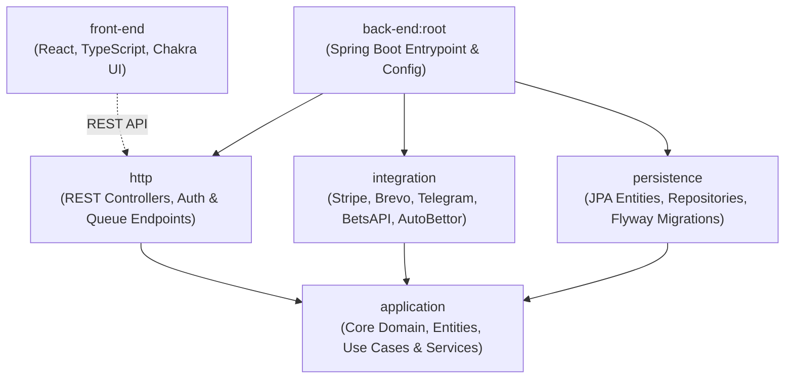
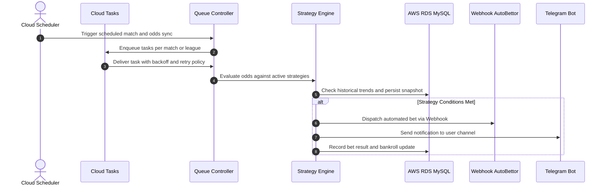

# ⚽ Stake Metrics

> High-Frequency Sports Analytics & Automated Bet Execution Platform (SaaS)  
> *Architected with Kotlin, Spring Boot 3, Clean Architecture, Google Cloud Run & Tasks, and React.*

---

[](#-note-on-project-origin--discontinuation)
[](#-note-on-project-origin--discontinuation)
[](#-note-on-project-origin--discontinuation)
[](#-note-on-project-origin--discontinuation)
[](https://kotlinlang.org/)
[](https://spring.io/projects/spring-boot)
[](https://openjdk.org/)
[](https://react.dev/)
[](https://www.typescriptlang.org/)
[](https://cloud.google.com/)
[](https://aws.amazon.com/rds/)
[](LICENSE)

---

## 📖 Note on Project Origin & Discontinuation

> Stake Metrics came out of two converging goals early in my software career. The first was an engineering milestone: I wanted to build and operate a complete full-stack product end to end as a solo developer, taking an idea from an empty repository through cloud architecture, automated subscriptions, production deployment, and real paying customers.
>
> The second was practical machine learning research. Like many people studying predictive modeling, I needed data-rich environments with clear, verifiable feedback loops. While financial market forecasting is the standard route, I chose to explore sports betting markets and odds movements instead. Sports data streams provided equally dense time-series data with lower regulatory barriers, accessible feeds, and measurable edges that allowed immediate validation of model predictions against bookmaker odds. The motivation was never sports gambling itself; it was finding a sandbox where data was abundant, hypothesis testing was cheap, and feedback cycles were fast.
>
> Bringing those two efforts together turned a technical experiment into an operational SaaS platform. The software performed well under load, scaled as a multi-module Kotlin and Cloud Tasks system, and attracted customers, peaking at nearly 100 active users.
>
> The decision to shut it down came down to how the project evolved. As commercial betting platforms expanded rapidly across Brazil, the social harm and friction tied to gambling became hard to ignore. What started as an individual study in predictive models and a solo engineering exercise had turned into an active commercial betting operation with real retail customers.
>
> I decided I no longer wanted to participate in that market or profit from it. On July 8, 2025, I permanently shut down production operations.
>
> The codebase remains here as an engineering portfolio piece: an entire system built from scratch to a production-ready, distributed architecture capable of high-throughput data processing for real users.

---

## 🛠️ What the Platform Does

Stake Metrics operated as a cloud-native SaaS that tracked live and pre-match sports events, identified statistically backed market opportunities, and executed user strategies autonomously.

### Core Capabilities

- **Real-Time Market Ingestion**: Polls and ingests match feeds, live odds fluctuations, and game statistics across global football and FIFA eSports matches.
- **Rules Engine & Strategy Evaluation**: Evaluates live odds against user-configured mathematical models (e.g., minimum expected value thresholds, volume triggers, match timing, bankroll percentage allocations).
- **Asynchronous Execution Pipeline**: Distributes ingestion and execution tasks across managed cloud queues, ensuring resilience against upstream rate limits and avoiding traffic spikes.
- **Automated Bet Dispatch**: Sends formatted execution webhooks to external execution partners when predefined market criteria trigger.
- **Real-Time Alerts & Reporting**: Delivers instant bet execution alerts and match updates via Telegram bots, alongside performance dashboards tracking return on investment (ROI), strike rate, and bankroll curves.
- **Subscription Management**: Integrates Stripe for self-service subscription plans, customer checkout sessions, and automated billing lifecycles.

---

## 🏗️ Architecture & Modules

The backend is built as a Gradle multi-module project enforcing Clean Architecture principles, strict boundary isolation, and dependency inversion:



### Module Breakdown

| Module | Purpose | Key Technologies |
| :--- | :--- | :--- |
| **`application`** | Core business logic, domain entities, rules engine, strategy matching, and interface contracts (`IAutoBettorService`, `IEmailService`, `ITelegramService`). Decoupled from framework dependencies. | Kotlin, Pure Domain |
| **`integration`** | Outbound adapters implementing application contracts: Stripe billing, transactional emails, Telegram alert bots, odds providers, and generic webhook auto-bettors. | OkHttp, Stripe Java SDK, Cloud Tasks Client |
| **`persistence`** | Database models, Spring Data JPA repositories, query optimizations, and Flyway database migrations. | Hibernate, JPA, Flyway, MySQL |
| **`http`** | Inbound HTTP adapters: REST API controllers, security filters, JWT authentication, and Google Cloud Tasks queue receivers. | Spring MVC, Spring Security |
| **`front-end`** | Single Page Application (SPA) offering operational dashboards, strategy configuration, analytics charts, and integration settings. | React 18, TypeScript, Chakra UI |

---

## ⚡ Asynchronous Ingestion & Execution Pipeline

To manage continuous polling and parallel strategy evaluations without blocking web threads or exceeding external rate limits, the platform relies on Google Cloud Tasks and Google Cloud Scheduler:



---

## 🧰 Tech Stack & Cloud Infrastructure

- **Languages & Frameworks**: Kotlin 1.9, Java 17, Spring Boot 3.3, React 18, TypeScript.
- **Compute & Serverless**: Google Cloud Run (Containerized Microservices).
- **Queuing & Scheduling**: Google Cloud Tasks (Distributed task processing with exponential backoff), Google Cloud Scheduler.
- **Database & Storage**: AWS RDS (MySQL 8), Flyway database migrations.
- **Security & Identity**: Stateless JWT, role-based authorization, rate-limiting headers.
- **External Services**: Stripe (Subscriptions & Webhooks), Brevo (Transactional Email), Telegram Bot API.

---

## 💻 Local Development Setup

### Prerequisites

- JDK 17+
- Node.js 18+ & npm
- Docker & Docker Compose (for local MySQL if needed)

### 1. Backend Setup

```bash
cd back-end

# 1. Prepare configuration
cp src/main/resources/application.properties.example src/main/resources/application-dev.properties

# 2. Run test suite
./gradlew test

# 3. Build artifact
./gradlew build
```

### 2. Frontend Setup

```bash
cd front-end

# 1. Prepare environment variables
cp .env.example .env.development

# 2. Install dependencies and start development server
npm install
npm start
```

---

## 📄 License & Intellectual Property

Copyright (c) 2024-2026 Tiago Ornelas. All rights reserved.

This repository is licensed under a **Source-Available & Non-Commercial Personal Use License**. See the full terms in the [LICENSE](LICENSE) file.

### Summary of Terms

- **Permitted**:
  - **Local Execution & Testing**: Running, testing, and using the software locally for private personal or educational purposes.
  - **Personal Modifications**: Modifying, adapting, and building upon the codebase strictly for personal, private, non-commercial use on your own environment.
  - **Inspection & Analysis**: Viewing and evaluating the source code and architecture for educational and technical research.
- **Strictly Prohibited**:
  - **Commercial Exploitation**: Using, copying, distributing, sublicensing, selling, renting, or monetizing this software (or modified versions), in whole or in part, as a commercial product, SaaS, or hosted service.
  - **Public Redistribution**: Publishing, mirroring, or distributing this source code (original or modified) on third-party repositories or public package registries without prior written authorization.

### ⚠️ Disclaimer on Real-Money Gambling

While local personal and educational use is permitted, the author does not recommend, encourage, or endorse using this software, its strategies, or its algorithms for real-money gambling or financial speculation. Gambling carries substantial financial risk, including total loss of capital. The author assumes no responsibility or liability for any financial losses, damages, or consequences resulting from the use or misuse of this code.
