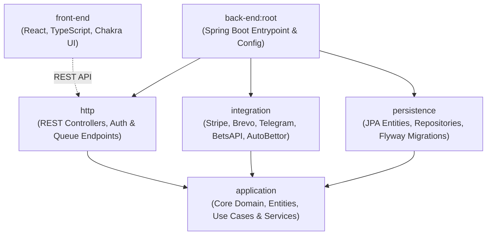
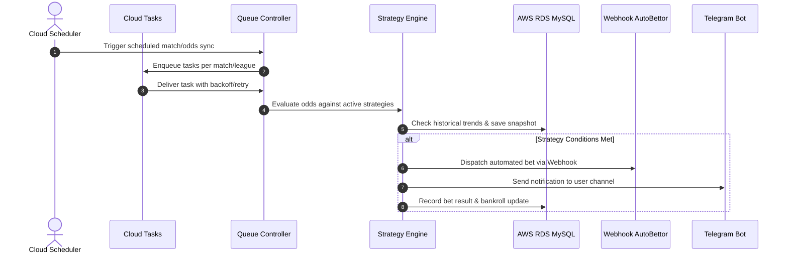

# Stake Metrics

> **High-Frequency Sports Analytics & Automated Bet Execution Platform (SaaS)**  
> *Architected with Kotlin, Spring Boot 3, Clean Architecture, Google Cloud Run & Tasks, and React.*

---

[](https://kotlinlang.org/)
[](https://spring.io/projects/spring-boot)
[](https://openjdk.org/)
[](https://react.dev/)
[](https://www.typescriptlang.org/)
[](https://cloud.google.com/)
[](https://aws.amazon.com/rds/)
[](LICENSE)

---

## 📌 Project Status & Portfolio Showcase

**Stake Metrics** was designed, built, and operated in production as a commercial SaaS for automated sports analytics and bot execution. The project has reached its end-of-life as an active commercial venture due to strategic realignment, and its codebase is presented here as an **engineering portfolio showcase**.

It demonstrates:
- **Clean Architecture** in Kotlin & Spring Boot across multiple decoupled modules.
- **Asynchronous, Distributed Processing** with resilient job queues via Google Cloud Tasks.
- **High-throughput Odds Processing** with rule engines, trend calculations, and bankroll strategy tracking.
- **Modern Front-end** with React, TypeScript, Chakra UI, and real-time operational feedback.

---

## 🏗️ Architecture & Modules

The backend is structured as a Gradle multi-module project enforcing strict boundary isolation and dependency inversion:



### Module Responsibilities

| Module | Responsibility | Key Technologies |
| :--- | :--- | :--- |
| **`application`** | Core business logic, domain entities, rules engine, strategy matching, and interface contracts (`IAutoBettorService`, `IEmailService`, `ITelegramService`). Zero framework dependencies where possible. | Kotlin, Pure Domain |
| **`integration`** | Outbound adapters implementing application contracts: Stripe billing, transactional emails, Telegram alert bots, odds providers, and generic webhook auto-bettors. | OkHttp, Stripe Java SDK, Cloud Tasks Client |
| **`persistence`** | Database models, Spring Data JPA repositories, query optimizations, and database migrations. | Hibernate, JPA, Flyway, MySQL |
| **`http`** | Inbound HTTP adapters: REST API controllers, security filters, JWT authentication, and Google Cloud Tasks queue receivers. | Spring MVC, Spring Security |
| **`front-end`** | Single Page Application (SPA) offering real-time dashboards, strategy configuration, analytics charts, and integration settings. | React 18, TypeScript, Chakra UI |

---

## ⚡ Asynchronous Ingestion & Execution Pipeline

The core mechanism runs on distributed, fault-tolerant queues powered by Google Cloud Tasks and Cloud Scheduler:



---

## 🛠️ Tech Stack & Cloud Infrastructure

- **Languages & Frameworks**: Kotlin 1.9, Java 17, Spring Boot 3.3, React 18, TypeScript.
- **Compute & Serverless**: Google Cloud Run (Containerized Microservices).
- **Queues & Orchestration**: Google Cloud Tasks, Google Cloud Scheduler.
- **Database**: AWS RDS (MySQL 8), Flyway database migrations.
- **Security & Auth**: Stateless JWT, role-based authorization, rate-limiting headers.
- **External Integrations**: Stripe (Subscriptions & Checkout), Brevo (Transactional Email), Telegram Bot API.

---

## 💻 Local Development Setup

### Prerequisites
- JDK 17+
- Node.js 18+ & npm
- Docker & Docker Compose

### 1. Backend Setup
```bash
cd back-end

# 1. Prepare configuration
cp src/main/resources/application.properties.example src/main/resources/application-dev.properties

# 2. Run tests
./gradlew test

# 3. Build artifact
./gradlew build
```

### 2. Frontend Setup
```bash
cd front-end

# 1. Prepare environment variables
cp .env.example .env.development

# 2. Install dependencies & run
npm install
npm start
```

---

## 📄 License & Intellectual Property

Copyright (c) 2024-2026 Tiago Ornelas. All rights reserved.

This project is licensed under a **Source-Available / Educational & Portfolio View-Only License**. See the [LICENSE](LICENSE) file for legal terms.

- **Permitted**: Viewing, reading, and architectural evaluation for hiring, portfolio, or academic research.
- **Prohibited**: Copying, modifying, redistributing, or using this codebase (in whole or in part) as a base to build, sell, or commercialize software.
